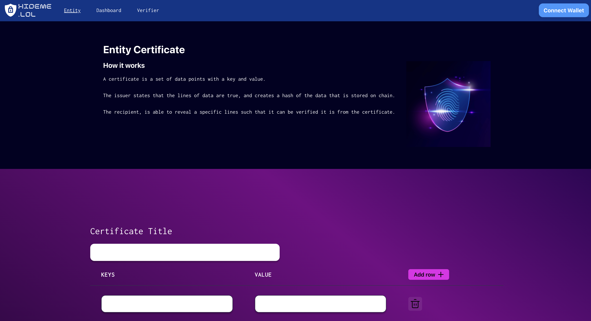
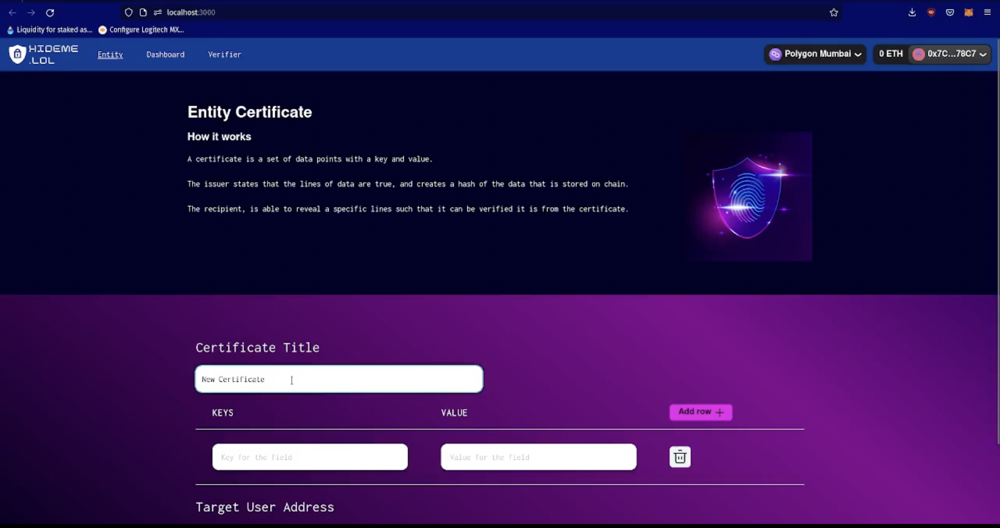
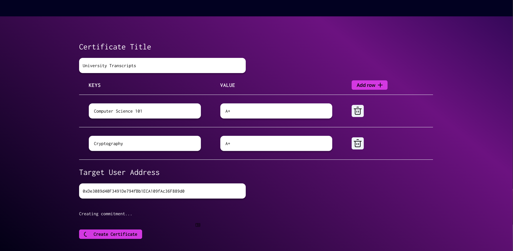
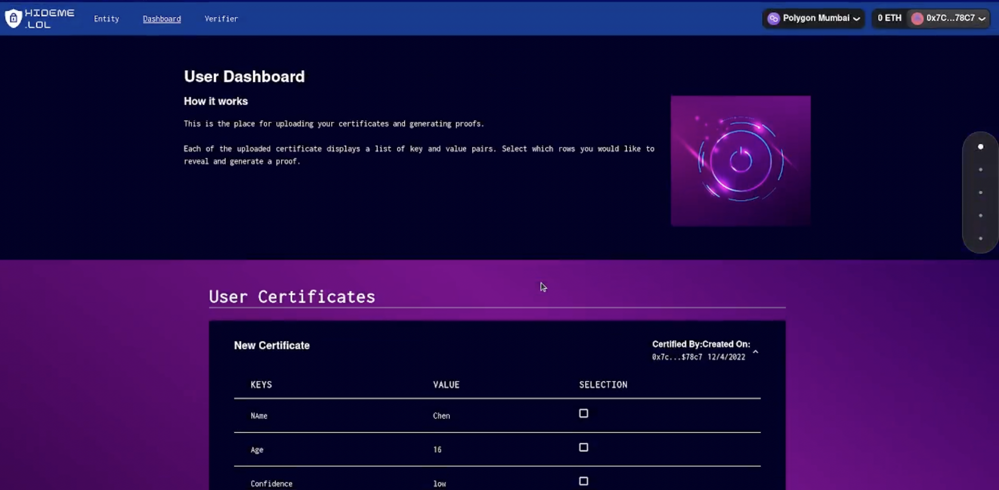
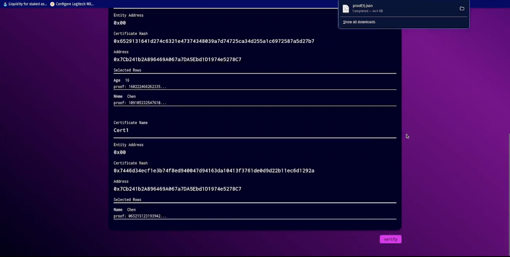

 

# ETH India - hideme.lol 🇮🇳 

## [**CLICK TO LIVE URL**](www.hideme.lol) 🚀

## **Background** 🤔

Protocols nowadays allow us to proof that data is correct by revealing nothing about it or preserving a fixed amount of itself. No one allows us to **CHOOSE** what we want to hide and what we want to expose.

## **Solution - hideme.lol** 💡

- A protocol which utilizes zero knowledge proof that makes this possible. **``(hideme.lol)``** 

- Allows people creators of certain data to commit a hash of the content to the blockchain (issuers), utilizing ethereum as a settlement layer. An issuer could be a DAO, a trade manager, random users, protocol, if we go outside the web3 world, we can count in universities, auditors, hospitals, etc. **``(Composable)``**

- The data is then sent to the owner in plain text ( receiver ) . The owner is now reponsibile of storing his/her own data. **``(Data Ownership)``**

- Owners of the data can choose only the information that they want to reveal, and generate a proof that the submitted information is part of the actual content **``(Privacy preserving)``**

- The verifier receives a proof and public input, performs a verification that the actual passed data matches the commited value stored on the blockchain **``(Secure & Trustworthy)``**

- Allow any party to have access to this technology, by letting the underlying zkp to be generic and flexible enough. **``(infrastructure)``**

## **Repos** 🙇🏽

- frontend : https://github.com/cwkang1998/hideme.lol
- server : https://github.com/jrcarlos2000/eth-india-server
- graph : https://github.com/cwkang1998/hideme.lol/tree/main/subgraph_hideme
- ZK-circuits [CORE] : https://github.com/cwkang1998/hideme.lol/tree/main/zk-circuit

## 🎧 [**Pitch**](pitch.com/public/3d327690-33fc-47d7-934c-9176566b2e92)

## **Video Demo** 📀

## **Technologies ( PoC )**

### ``HALO2 ( ZCASH )``

ZK Circuits are generated using the halo2 library in rust

### ``IPFS`` 

Data issued is encrypted and stored on-chain using IPFS. This doesnt require us to save our data in our computer, but at the same time keeping it private.

### ``Biconomy``

Provides us with social login and gasless transactions for a much better user experience, allowing us to easily onboard non web3 users into our protocol

### ``Push``

When data is ``issued`` we notify the receiever via ``email`` by using Push Protocol SDK, connecting it to our mail bot

### ``The Graph``

Indexes the transactions and data of the commitment hashes issued by entities to users. Helps to keep better track and its more efficient than reading from the blockchain. 

### ``Covalent``

### ``QuicknNode``

### ``Polygon``

 

# ZK Technical design
## **Design of the document**

A generic form that consist of two columns (one row for title, another row for content). Up to 10 rows.

eg:
| Title | Content |
| --- | --- |
| Name | CC |
| AGe | xx |
| | |

Each row is able to store string of text. The title depends on the use case, for example in a health certificate, we can imagine that there will be row with the title `blood_type` with the `content` A+ for example. This can be as flexible as possible.

 

## **Generation of commitment hash**

We utilizes Poseidon hash function as it is a Snark friendly hash function that will allow us to reduce the number of constraints as compared to when we use sha256.
We perform a double hashing mechanism (i.e horizontal and vertical).

 

## **Horizontal hashing**

| Title | Content | Horizontal Result |
| ----- | ------- | ----------------- |
| Name  | CC      | hash_row_1        |
| AGe   | xx      | hash_row_2        |
| ...   | ...     | ...               |

The horizontal hashing hashes the title and content row by row, producing a resultant hash for that row as seen in `Horizontal Result` above.
 

## **Vertical hashing**

| Horizontal Result |
| ----------------- |
| hash_row_1        |
| hash_row_2        |
| ...               |
| final accumulated |

The vertical hashing acts like an accumulator for the horizontal hashing.
It takes the first two rows, hashes them together and results in the current accumulator. The current accumulator is hashed with the following row and returns the most recent accumulator result. The process repeats until all rows have been hashed.

The result of the accumulated hash will be our commitment hash that we will publish to the block chain.

By publishing on the commitment hash, we are:

1. ensuring that the file in untampered
2. maintain privacy to the content of the file

 

## **Proof generation**

The owner of document is able to select one row at a time to reveal (tbd to extend to multiple rows) and will generate a zk proof to proof that the information of the selected row is correct

The public inputs consist of the file commitment and the information of the selected row.

The private inputs will be the content of the entire document and also the `selector_index`, displayed as an array of ones and zeros. One representing the selected row.

 

## **Concurrency management**

As our solution is designed to be generic, there may be cases whereby the committed hash changes rather often. As a result, while the prover takes time to generate proof on a commited hash, a new hash overwrites the hash and this will cause the proof verification to fail.
As such, we design a ring buffer data structure to store the commited hash and the verifier is allowed to query the commited hash up to a certain history depth

 

## **Circuit explanation**

The private inputs is hashed and is contrainted to the file commitment (public input). This ensure that the file is not tampered.

The selected row is checked by the circuit to ensure that it exist in the document. This is done by comparing the Horizontal hash with the Horizontal hash of our selected row in the public input

Finally, the selector index in also constraint to boolean values to ensure soundness of the proof.

 

 

# **Benchmarks**

| Row number | time elapsed (s) |       |       | k   |
| ---------- | ---------------- | ----- | ----- | --- |
| 2          | 4.88             | 5.14s | 4.82s | 10  |
| 3          | 5.27             | 5.33  | 5.31  | 10  |
| 4          | 8.68             | 8.71  | 8.88  | 11  |
| 5          | 9.20             | 9.19  | 9.29  | 11  |
| 6          | 9.72             | 9.89  | 9.75  | 11  |
| 7          | 16.14            | 15.76 | 15.89 | 12  |
| 8          | 16.90            | 16.30 | 16.69 | 12  |
| 9          | 16.72            | 16.77 | 16.76 | 12  |
| 10         | 17.40            | 17.31 | 17.43 | 12  |
| 11         | 18.32            | 17.89 | 17.80 | 12  |
| 12         | 18.27            | 18.28 | 18.43 | 12  |
| 13         | 30.08            | 30.19 | 29.95 | 13  |
| 14         | 30.43            | 30.63 | 30.93 | 13  |

# **Screenshots**

